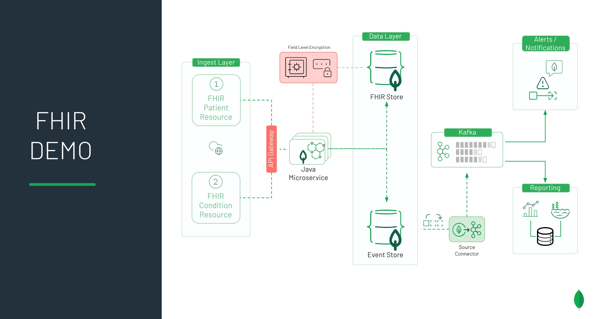

# fhir-webservice

The purpose of this demo is to provide a sample FHIR Server to consume
[FHIR](http://hl7.org/fhir) messages and resources.  FHIR is a standard for 
health care data exchange, published by HL7.

This application was demonstrated as part of the webinar: Modernizing Healthcare 
Architecture With MongoDB & Confluent delivered on Wednesday, Sept. 16, 2020.

The following technologies have been utilized for this demo:
* [Spring Boot](https://spring.io/projects/spring-boot)
* [Spring Data](https://spring.io/projects/spring-data)
* [Spring Security](https://spring.io/projects/spring-security)
* [Hapi-FHIR](https://hapifhir.io/)
* [MongoDB Atlas](https://cloud.mongodb.com/)
    * [Free MongoDB Atlas Sign-up](https://www.mongodb.com/cloud/atlas/signup)
* [MongoDB Automatic Client-side Field Level Encryption](https://docs.mongodb.com/manual/core/security-client-side-encryption/)
* [MongoDB Realm](https://docs.mongodb.com/realm/)
* [Twilio](https://www.twilio.com/)

Pre-requisites:
* MongoDB minimum 4.2 (Enterprise Advanced or MongoDB Atlas)
    * Note: If using MongoDB Atlas, download MongoDB Enterprise Advanced
    in order to have access to a local mongocryptd binary
    
* Java 11 and Maven

* master-key file for Client-Side Field Level Encryption.  This can be done
easily by running the Java class CreateMasterKeyFile from this [MongoDB client-side FLE example](https://github.com/blainemincey/clientfle).

* Modify the appropriate values in src/main/resources/application.properties.example
    * After making edits, be sure to rename this file to application.properties prior
    to execution
    
* [Postman](https://www.postman.com/)

* [MongoDB Kafka Connector](https://docs.mongodb.com/kafka-connector/master/) - Follow directions that will
direct you to the Docker images linked via Confluent for Kafka below.
    * [Confluent for Kafka](https://github.com/mongodb/mongo-kafka)
    
Execution Steps:
* After starting the Docker images for Confluent for Kafka, run the bash script `/kafkaConnectors/createKafkaConnectors.sh`.
This will create 2 MongoDB Source Connectors and 2 MongoDB Sink Connectors.

* Follow the MongoDB Realm documentation to create a Realm Web Application and then create a Realm Trigger to generate
a notification via Twilio (SMS Message) when an 'Influenza' event occurs.  Configuration of those items are outside
the scope of this README.  However, a sample Realm Trigger Javascript function is included in `/realm/influenzaTriggerFunction.js`

* Compile the project from the root directory: `mvn clean package -DskipTests`
    * If you get an error, did you generate and include the master-key.txt?

* An executable JAR is built in the previous step so you can: `java -jar target/FhirWebService.jar`
    * Or, you can simply: `./mvnw spring-boot:run`

* Create a POST request in Postman to: `http://localhost:8090/processFhir/patient`
    * Set Authorization to Basic Auth and enter the username/password for Spring Security from application.properties
    * For the Body, select Raw and JSON as the type
    * Paste the contents of `/fhirResourceSamples/patient.json` into the Body
    * Click the Send button and if successful, a Patient model object with the MongoDB generated id field will be returned

* Create a separate POST request in Postman to: `http://localhost:8090/processFhir/condition`
    * Authorization can be shared with what was configured above
    * For the Body, select Raw and JSON as the type
    * Paste the contents of `/fhirResourceSamples/condition-influenza.json' into the Body
    * Click the Send button and if successful, the Patient model above should be returned with an embedded object
    containing the Influenza condition
    
* If Kafka, the MongoDB Source/Sink Connectors, Realm Web and Twilio have been configured correctly, you should
receive a notification with the phone number you configured of an Influenza event.  It is easy (and free) to acquire a Google Voice
number for demo purposes.
    
* As a full round-trip test, create a GET request in Postman to: `http://localhost:8090/processFhir/getPatient/123456789-1`
    * Authorization can be shared with what was configured above
    * Click the Send button and if successful, the sample Patient Model and Condition should be returned
    
* If you have access to MongoDB Compass or the MongoDB Atlas Data Explorer, connect to the cluster and review the patient collection for your
inserted document.  You will see several fields with '*********' as a value.  This is the cyphertext as a result
of these fields using Client-Side Field Level Encryption.

* Check the fhirReporting database for the event stream data.  You should see two separate collections: one for Influenza notifications
and a separate result collection with ALL possible condition events.

* If you would like to generate additional data using this framework above, a set of utility classes are included
within this project to assist with this.  If you are using an IDE or familiar with Java, run the main method in the
`/utils/PatientFhirGenerator` class.  Or, simply use Postman (using basic auth of course) and make a POST call
to `http://localhost:8090/processFhir/generatePatientData/100` where the last parameter is the number of patients
to generate. 

    
    

